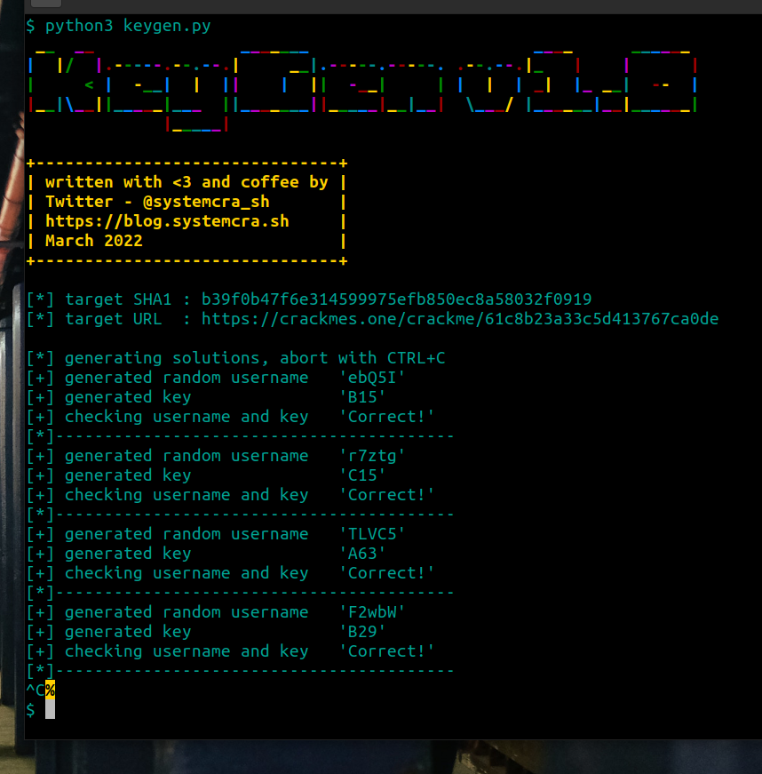

# dev0 crackme solution

This was a fun little Reverse Engineering / Key-gen Challenge I did a while ago.

**Usage**

1. Clone the repository.

1. Install the packages with `pip install -r requirements.txt`.

2. `cd` into the directory, `unzip` the archive with the password `crackmes.one` to get the challenge binary.

3. Simply execute `python3 keygen.py`.

**Notes**

1. ~~I'm working on a writeup of the challenge, I'll update this page once it's done.~~
   You can find my writeup of this challenge [here](https://systemcra.sh/posts/dev0-crackme-writeup/)

2. The solution is neither perfect nor fast but it will generate valid Username+Key pairs.

3. The `requirements.txt` includes a bunch of stuff that is not needed, I was too lazy to 
   clean up my venv.
